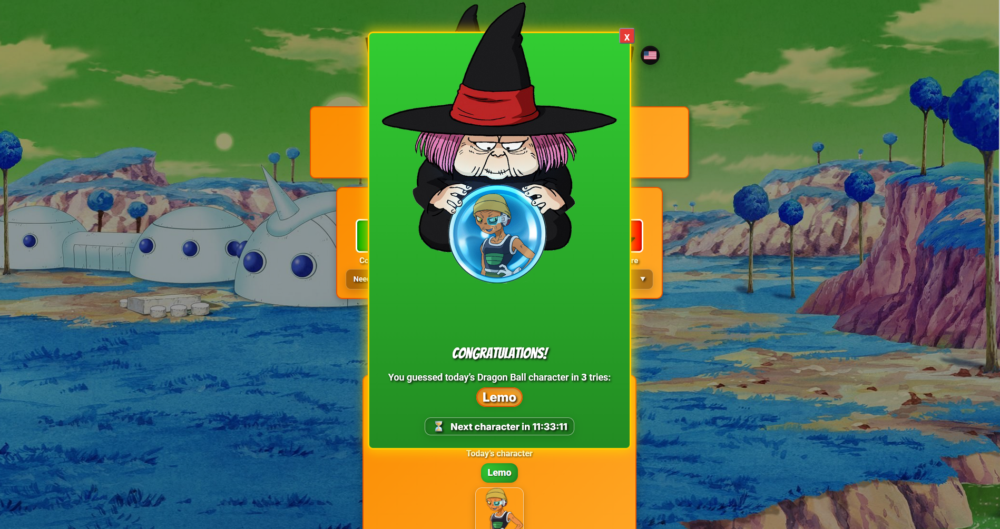

## DragonBallDle

DragonBallDle é um jogo diário de adivinhação inspirado em “wordle‑likes”, focado no universo de Dragon Ball.
Todo dia existe **um personagem diferente** e o jogador tenta adivinhar com base em atributos como saga, raça, gênero, transformações e afiliações.

### Objetivo do projeto

- **Entretenimento**: criar um desafio diário rápido e viciante para fãs de Dragon Ball.
- **Experiência multilíngue**: o jogo suporta vários idiomas via sistema de i18n.
- **Estudo de arquitetura front+backend**: o repositório demonstra:
  - SPA com Vite.
  - Backend simples em PHP para contagem de vitórias diárias.
  - Integração com Docker e esteiras de deploy (GitHub Actions).

---

## Tecnologias principais

- **Frontend**
  - `Vite` (build e dev server com suporte a Multi-Page App via rollupOptions)
  - CSS Moderno (`/src/styles/`) com Custom Properties (`var(--token)`) e Cascateamento (`@layer`)
  - JavaScript Vanilla Modular (`/src/ui`, `/src/state`, `/src/utils`)
  - Sistema de i18n Nativo (`/src/state/i18n.js` + `/locales`) com extrações dinâmicas

- **Backend**
  - PHP 8.2 (imagem `php:8.2-apache`)
  - Endpoint `api/wins.php` para registrar/consultar as vitórias do dia
  - Persistência em arquivos JSON diários (`data/wins`)

- **Infra / DevOps**
  - `Dockerfile` multi‑stage: build do front com Node/pnpm + server Apache/PHP servindo `dist/` e `api/`.
  - GitHub Actions para build, push da imagem Docker e deploy automatizado em servidor remoto.
  - `.htaccess` com regras de:
    - i18n por path (`/en-us/`, `/pt-br/`, etc.).
    - SPA servindo sempre o mesmo `index.html`.
    - Redirecionamentos pensados para produção, mas neutros em `localhost`.

---

## Como rodar localmente (sem Docker)

Pré‑requisitos:

- Node.js (versão compatível com Vite 7)
- `pnpm` (recomendado; o projeto foi configurado com `pnpm`)

Passos:

```bash
cd dragonballdle.site
pnpm install
pnpm dev
```

Depois acesse:

```text
http://localhost:5173/en-us/
```

> Observação: o backend PHP (`api/wins.php`) precisa de um servidor PHP rodando (por exemplo, Apache ou `php -S`) para registrar/consultar vitórias. Em desenvolvimento, você pode:
>
> - Rodar um Apache/PHP local apontando para a pasta `api/`, ou
> - Usar o container Docker descrito abaixo.

---

## Rodando com Docker

Build da imagem (na pasta que contém `dragonballdle.site` e `api`):

```bash
cd d:\Projects   # ou equivalente no seu sistema
docker build -f dragonballdle.site/Dockerfile -t dragonballdle-site .
```

Rodando o container:

```bash
docker run --rm -p 8080:80 --name dragonballdle dragonballdle-site
```

Acesse:

```text
http://localhost:8080/en-us/
```

---

## Uso de variáveis de ambiente

### Frontend (Vite)

As variáveis usadas no front vivem em arquivos `.env`:

- `.env` (base)
- `.env.development`
- `.env.production`

Todas que forem usadas no código precisam ter prefixo **`VITE_`**, por exemplo:

```env
VITE_DAILY_SECRET=...
VITE_FORCE_YMD=true
```

No código:

```js
const forceYmd = import.meta.env.VITE_FORCE_YMD === "true";
```

No build Docker/CI, o Vite lê `.env.production` criado pela esteira (a partir de GitHub Secrets).

### Backend (PHP)

O backend atual é bem simples e não depende de `.env`.
Se for necessário no futuro, você pode:

- Ler variáveis de ambiente via `getenv('NOME')` na aplicação PHP, ou
- Introduzir uma lib como `vlucas/phpdotenv` para carregar um `.env` específico do servidor.

---

## Fluxo de deploy (GitHub Actions)

O repositório pode usar um workflow de deploy que:

1. Gera um `.env.production` para o Vite com base em GitHub Secrets.
2. Faz `docker build` usando o `Dockerfile` do projeto.
3. Faz `docker push` da imagem para um registry (Docker Hub ou GHCR).
4. Conecta no servidor via SSH e:
   - Faz `docker pull` da nova imagem.
   - Derruba o container antigo.
   - Sobe o container atualizado.

Esse fluxo torna o deploy praticamente automático a cada push na `main`.

---

## Estrutura simplificada

Algumas pastas/arquivos importantes:

- `index.html` – HTML principal da SPA, carrega o bundle Vite, design e o entrypoint principal.
- `404.html` – Página servida em caso de Not Found, acoplando i18n automático nativo sem bibliotecas.
- `src/`
  - `main.js` – Ponto de injeção global que inicializa ferramentas e paraleliza as promessas principais.
  - `head-seo.js` – Controlador para injetar Title e Tags de SEO dinâmicas para web-crawlers em 20+ linguagens com base em rotas.
  - `styles/` – Estilizações modulares guiadas por `index.css` orquestrando: `base`, `layout`, `components` e `utilities`.
  - `state/` – Camada de gerenciamento de dados essenciais e cache do app (Engine, I18n).
  - `ui/` – Componentes limpos para montar botões, animações e listeners no DOM.
  - `utils/` – Helpers assíncronos não acoplados ao DOM (como parseamento de datas).
- `public/`
  - `characters-*.js` – Bancos de personagens por idioma exportados globalmente via script JSONP.
  - Assets de imagens, bandeiras `.svg` e ícones `.ico`.
- `api/wins.php` – endpoint para registrar/ler vitórias diárias no container backend.
- `.htaccess` – regras de rewrite para i18n, SPA e redirecionamentos server-side.
- `Dockerfile` – build do frontend otimizado com Node + Servidor Apache/PHP para ambiente local/produção.

---

## Capturas de tela



---

## Licença e créditos

### Código deste projeto

O código deste repositório é licenciado sob a **[MIT License](LICENSE)**. Você pode usar, modificar e redistribuir conforme os termos do arquivo [LICENSE](LICENSE).

### Créditos

- **Arthur Coelho** — [LinkedIn](https://www.linkedin.com/in/arthur-coelho-9a77a1216/)
- **Júlio Villa Pires** — [LinkedIn](https://www.linkedin.com/in/j%C3%BAlio-villa-pires-2678431b8/)
- **Gildo Júnior** — [LinkedIn](https://www.linkedin.com/in/gildofj/) [Github](https://github.com/Gildofj)

### Aviso de marcas e direitos autorais

**Dragon Ball** e todos os personagens, nomes, imagens e elementos relacionados são marcas registradas e/ou obras protegidas por direitos autorais de seus respectivos titulares, incluindo, mas não limitado a: **Toei Animation Co., Ltd.**, **Bandai Namco Entertainment Inc.**, **Shueisha Inc.** e demais detentores oficiais.

Este projeto é um jogo de fãs, **não oficial** e **sem qualquer afiliação, aprovação ou endosso** pelos titulares dos direitos de Dragon Ball. Trata-se de projeto educacional e de entretenimento, de forma **não comercial**. O uso de referências a Dragon Ball é feito em caráter de paródia/homenagem e fair use, respeitando os direitos dos criadores originais.

Se você é detentor de direitos e deseja solicitar alteração ou remoção de conteúdo, entre em contato pelos canais indicados no README.
